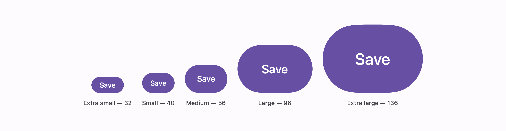

# Button

Material 3's button, in all five emphases and all five sizes.


```swift
Button("Save") { save() }
    .buttonStyle(.expressive)
```

That is the filled button at its default size. Any other emphasis is an argument:

```swift
Button("Cancel") { dismiss() }
    .buttonStyle(.expressive(.text))
```

## Variants

| This | Compose | Container | Content |
| --- | --- | --- | --- |
| `.filled` | `Button` | `primary` | `onPrimary` |
| `.elevated` | `ElevatedButton` | `surfaceContainerLow`, level 1 | `primary` |
| `.tonal` | `FilledTonalButton` | `secondaryContainer` | `onSecondaryContainer` |
| `.outlined` | `OutlinedButton` | none, 1pt `outlineVariant` | `onSurfaceVariant` |
| `.text` | `TextButton` | none | `onSurfaceVariant` |

Emphasis runs down that table. Filled is the one action that completes a flow; text is for actions
that must not compete with anything.

## Sizes



```swift
Button("Join now") { join() }
    .buttonStyle(.expressive(.filled, size: .large))
```

A size is not just a height. The padding, the label and the pressed corner all move with it:

| Size | Height | Padding | Label | Pressed corner |
| --- | --- | --- | --- | --- |
| `.extraSmall` | 32 | 16 | 14 | 8 |
| `.small` (default) | 40 | 16 | 14 | 8 |
| `.medium` | 56 | 24 | 16 | 12 |
| `.large` | 96 | 48 | 24 | 16 |
| `.extraLarge` | 136 | 64 | 32 | 16 |

Everything there is a `Button*Tokens` value except the label sizes, which are Material's type scale —
label large through headline medium. The size tokens carry no font of their own.

## The press

The container is a pill at rest and morphs to a squarer corner while held —
`ContainerShapeRound` to `PressedContainerShape` — on the `fastSpatial` spring. That morph is the
whole press feedback: no dimming, no scaling. It is also why the container is a rounded rectangle
rather than a `Capsule`, since the two corners have to animate into each other.

## Disabled

The container drops to `onSurface` at 10% and the label to `onSurfaceVariant` at 38%, which is
Material's disabled pair rather than an opacity over the whole control. An outlined button keeps its
border at the same 38%.

```swift
Button("Save") { save() }
    .buttonStyle(.expressive)
    .disabled(true)
```

## Icons

The style sets the label's font, and an SF Symbol in a `Label` scales with it:

```swift
Button("Like", systemImage: "heart.fill") { like() }
    .buttonStyle(.expressive(.tonal, size: .medium))
```

Compose sizes button icons from their own token — 20pt at small, up to 40pt at extra large — and
follows them with `IconLabelSpace`. Here the symbol takes its size from the label's font instead,
which lands close at every size and keeps the call site an ordinary SwiftUI `Button`.
