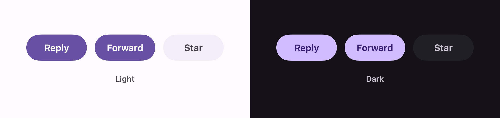
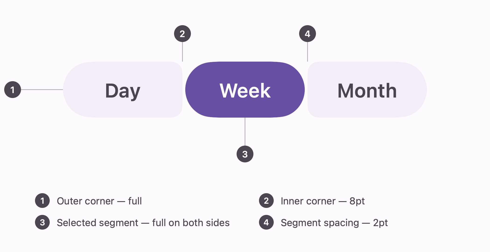

# Button group

Material 3 has two of these: a **standard** group, where a row of buttons sits 12pt apart, and a
**connected** group, where segments sit 2pt apart with their corners squared off against each other
to read as one control. Both squeeze: pressing a button widens it and its neighbours give up the
space.

## Standard



```swift
ExpressiveButtonGroup(items: [
    .init(label: "Reply") { reply() },
    .init(label: "Forward") { forward() },
    .init(label: "Star", isOn: $starred)
])
```

The initialiser you call decides the kind of button, matching Compose's two:

| This | Compose | Behaviour |
| --- | --- | --- |
| `.init(label:systemImage:action:)` | `clickableItem` | Runs an action. Always filled. |
| `.init(label:systemImage:isOn:)` | `toggleableItem` | Carries a checked state. Filled when checked, `surfaceContainer` when not. |

## Connected


One choice out of a set:

```swift
ExpressiveConnectedButtonGroup(selection: $range, options: [
    .init(value: .day, label: "Day"),
    .init(value: .week, label: "Week"),
    .init(value: .month, label: "Month")
])
```

Any number of choices — pass a `Set` and the segments toggle independently:

```swift
ExpressiveConnectedButtonGroup(selection: $activeFormats, options: formats)
```

### Anatomy



The corner rules *are* the component. A segment is a pill where the group meets the outside and
barely rounded where one segment meets the next; a selected segment goes full on both sides, because
it is the one being read rather than part of a run.

## The squeeze

Pressing a button expands it by 15% of its width — `ButtonGroupDefaults.ExpandedRatio` — and its
neighbours give up that much between them, so the group's own width never changes. Pass
`expandedRatio:` to change it; `0` turns it off.

Both groups share their width equally between buttons rather than sizing each to its label. Compose
measures children intrinsically and hands the leftovers to a per-item `weight`; that has no cheap
equivalent in SwiftUI, and an exact squeeze needs a width to expand from. A label that does not fit
shrinks rather than wraps.

## Geometry

| Token | Standard | Connected |
| --- | --- | --- |
| `ContainerHeight` | 40 | 40 |
| `BetweenSpace` | 12 | 2 |
| `InnerCornerCornerSize` | — | 8 |
| `PressedInnerCornerCornerSize` | — | 4 |
| Outer corner | full | full |

## Colour

| State | Container | Content |
| --- | --- | --- |
| Selected, or a plain action | `primary` | `onPrimary` |
| Unselected | `surfaceContainer` | `onSurfaceVariant` |

Disabled drops to 38% opacity, per button or for the whole group.

## Not implemented

Compose's `ButtonGroup` does three more things this does not:

- **Overflow.** When the buttons do not fit, Compose collapses the extras into a dropdown menu
  behind an indicator button. Here, labels shrink instead.
- **Per-item weights.** Buttons share the width equally.
- **Vertical groups.**

## Images

Rendered from the shipping components. Regenerate them with:

```
swift run --package-path Tools/ScreenshotGenerator
```
