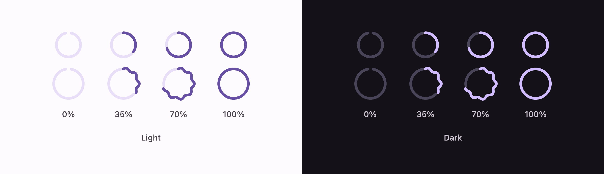

# Circular progress indicators

The ring versions of [the linear pair](LinearProgressIndicator.md) — flat, and the wavy one
Expressive added.



```swift
ExpressiveCircularProgressIndicator(progress: 0.4)
ExpressiveCircularWavyProgressIndicator(progress: 0.4)
```

Leave the progress out and either runs indeterminate.

## Indeterminate has no track

This is the one thing about the circular indicator worth knowing.
`circularIndeterminateTrackColor` is **transparent**, while the determinate one's track is
`secondaryContainer`. A lone arc travelling an empty ring is what tells you the app does not know
how long this will take — and it is the difference people notice between the two states without
being able to name it.

## The indeterminate motion

Six seconds, and not one motion but three laid over each other:

| | What it does |
| --- | --- |
| Steady rotation | three full turns — `CircularGlobalRotationDegreesTarget` is 1080° |
| Stepped rotation | four quarter-turns, each taking 300ms then holding until the next 1500ms mark |
| Sweep | grows from 10% of the ring to 87% by 3000ms, then closes back on `EasingStandard` |

The quarter-turns are what give it its character: it lunges, waits, lunges again. They are keyframes
rather than a curve, so they are written out as keyframes.

A cycle ends 1440° round — four whole turns — which is why it wraps to zero without a jump.

## The wave

| Token | Value |
| --- | --- |
| `WaveSize` (container) | 48 |
| `Size` (flat container) | 40 |
| `TrackThickness` | 4 |
| `ActiveWaveAmplitude` | 1.6 |
| `ActiveWaveWavelength` | 15 |
| `TrackActiveSpace` | 4 |

The wave is smaller and tighter than the linear one — 1.6pt at 15pt rather than 3 at 40 — because it
has to read around a 48pt ring rather than along a 240pt bar. It flattens below 10% and above 95%,
exactly as the linear one does.

**The wavelength is snapped so a whole number of waves fits the ring.** Left alone, the wave arrives
back at its start mid-crest, and a full ring shows a seam where the two ends meet at different
heights. A bar has two ends that never meet; a ring does not.

## The gap is an angle

A 4pt gap on a ring is a wider angle on a small ring than on a big one, so it has to be converted
through the radius rather than used as it is. That is the only piece of arithmetic the circular
indicators need that the linear ones do not.

## Colour

| Part | Determinate | Indeterminate |
| --- | --- | --- |
| Arc | `primary` | `primary` |
| Track | `secondaryContainer` | none |
