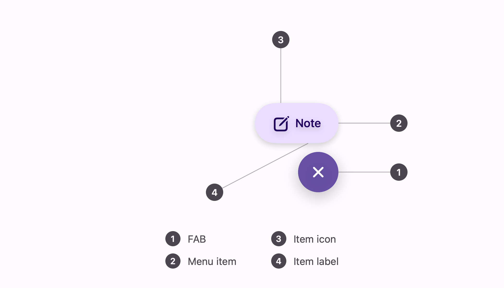

# FAB menu

A floating action button that opens into a column of labelled actions. Part of Material 3's button
family, and one view rather than a FAB you wire to a menu yourself: the two halves share the state
that makes it a menu.


```swift
ExpressiveFABMenu(
    items: [
        .init(systemImage: "square.and.pencil", label: "Note") { compose(.note) },
        .init(systemImage: "camera", label: "Photo") { compose(.photo) }
    ]
)
```

Put it in an overlay pinned to the bottom-trailing corner. Closed, it is 56x56; it grows upward from
there, so it never asks for the space its open state needs.

```swift
content
    .overlay(alignment: .bottomTrailing) {
        ExpressiveFABMenu(items: items)
            .padding(16)
    }
```

## Anatomy



1. **FAB** — 56x56, 16pt corners closed. Open, it becomes a circle and the icon turns 45°, which
   makes a plus into a close without needing a second symbol.
2. **Menu item** — a 56pt capsule, as tall as the FAB and as wide as its label.
3. **Item icon** — 24pt, leading.
4. **Item label** — a `LocalizedStringKey`, so a literal at the call site is translated for free.

## Behaviour

Items come out one at a time, 65ms apart, starting with the one nearest the FAB, and go back in the
opposite order — the column reads as unfolding from the button rather than arriving as a block.

Everything moves on `ExpressiveMotion.fastSpatial`, the spring Material names for movement.

Choosing an item closes the menu first and then runs its action, so a sheet or a navigation push
never animates on top of a menu that is still open.

Closed, the items are scaled to nothing against their trailing edge, hidden from hit testing, and
hidden from accessibility, so nothing behind the FAB is intercepted by a menu nobody can see.

## Controlling it

Pass `isOpen` when something outside the menu has to close it — a tab change, a sheet, a back
gesture:

```swift
ExpressiveFABMenu(isOpen: $menuOpen, items: items)
```

Without it the menu owns its own state, which is what a screen with one FAB wants.

## Colour

| Part | Role |
| --- | --- |
| FAB container | `primary` |
| FAB icon | `onPrimary` |
| Item container | `primaryContainer` |
| Item icon and label | `onPrimaryContainer` |

The items sit a step below the FAB on purpose: the FAB is the accent, and a column of equally loud
buttons above it would have nothing to point back to.

## Accessibility

The FAB's label changes with its state — "Open menu" closed, "Close menu" open — and both are
parameters, so a menu that adds something rather than opening things can say so:

```swift
ExpressiveFABMenu(
    accessibilityLabel: "Add",
    closeAccessibilityLabel: "Close add menu",
    items: items
)
```

Items are ordinary buttons and read their own labels.

