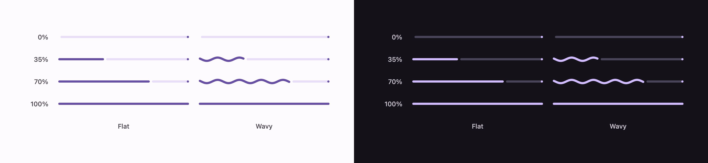

# Linear progress indicators

Two of them: the flat one, and the wavy one Expressive added.



```swift
ExpressiveLinearProgressIndicator(progress: 0.4)
ExpressiveLinearWavyProgressIndicator(progress: 0.4)
```

Leave the progress out and either one runs indeterminate:

```swift
ExpressiveLinearProgressIndicator()
ExpressiveLinearWavyProgressIndicator()
```

## Three parts, not two

A Material progress bar is not one bar drawn over another. It is the filled part, a 4pt gap, and the
track — plus a dot at the far end that stays where it is. The gap and the dot are what make it read
as Material, and both are tokens: `TrackActiveSpace` and `StopSize`, each 4.

The dot is drawn at every progress, including zero, where it and the track are all there is.

## The wave

| Token | Value |
| --- | --- |
| `ActiveWaveAmplitude` | 3 |
| `ActiveWaveWavelength` | 40 |
| `IndeterminateActiveWaveWavelength` | 20 |
| `WaveHeight` (container) | 10 |
| `ActiveThickness` | 4 |

The wave travels at one wavelength per second — in Compose, `waveSpeed` defaults to `wavelength`,
which is what that sentence means — so it reads as motion *along* the bar rather than a shape
wobbling in place. The phase belongs to the track rather than to a bar, so an indeterminate bar
sliding along moves through the wave instead of carrying its own.

Only the filled part waves. The track stays straight.

### The wave flattens at both ends

`WavyProgressIndicatorDefaults.indicatorAmplitude` is 0 below 10% and above 95%, and full between —
so the indicator settles as it arrives rather than stopping mid-crest. The change eases over 500ms,
so the wave grows and dies rather than appearing.

An indicator that comes on screen at 40% starts already waving; it does not grow into it. That is a
small departure from Compose, which animates from zero on first composition.

## The indeterminate motion

Four keyframes inside a 1750ms loop — two bars, each with a head and a tail:

| | Delay | Duration |
| --- | --- | --- |
| First bar, head | 0 | 1000 |
| First bar, tail | 250 | 1000 |
| Second bar, head | 650 | 850 |
| Second bar, tail | 900 | 850 |

Each runs on `EasingEmphasizedAccelerate` — a cubic Bézier at (0.3, 0, 0.8, 0.15), which holds back
and then goes. That curve is most of what makes the two bars read as Material rather than as two
things sliding, so it is ported rather than approximated, along with the solver that turns an x back
into a y.

The track is drawn in whatever is left between the bars, keeping the 4pt gap on both sides of each.

## Colour

| Part | Role |
| --- | --- |
| Filled, and the stop dot | `primary` |
| Track | `secondaryContainer` |
