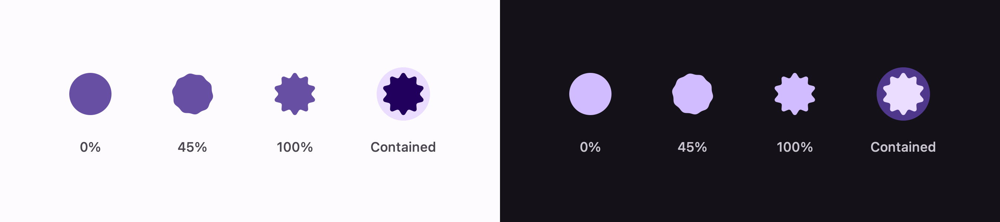

# Loading indicator

A shape that spins while morphing through a sequence of others.



```swift
ExpressiveLoadingIndicator()                 // spins until it goes away
ExpressiveLoadingIndicator(progress: 0.4)    // morphs by how far along you are
ExpressiveLoadingIndicator(contained: true)  // on a primaryContainer circle
```

## The shapes


Those seven are `LoadingIndicatorDefaults.IndeterminateIndicatorPolygons`, in Material's own order.
The determinate indicator uses two — a circle opening into the soft burst — so its shape *is* its
progress.

Pass your own sequence to either:

```swift
ExpressiveLoadingIndicator(shapes: [.pill, .sunny, .oval])
```

## How the shapes are built

Android builds these with `androidx.graphics.shapes`: a `RoundedPolygon` is a list of vertices with
per-corner rounding, and a `Morph` matches the cubic curves of two polygons so one can be tweened
into the other.

`MaterialShapes` publishes the figures for every shape — the points, their corner radii, how many
times they repeat around the centre — so those are what the shapes here are built from, not from
anybody's eye. Each one is assembled as a polygon, its corners replaced by arcs tangent to both
edges, and only then flattened into the form the morph needs.

Two details of that are worth naming, because both change the silhouette:

- **Edges are shared between the corners at their ends.** A corner takes the cut-back it asked for
  unless its neighbour wants the same stretch of edge, and then both give way in proportion. Capping
  every corner at half an edge instead is the obvious thing to do and it is wrong: it starves a big
  corner sitting next to a small one, which is the difference between a fat four-sided cookie and a
  thin star.
- **Straight edges are walked, not sampled at their ends.** Interpolating between two vertices in
  polar coordinates bows the edge outward, which turns a pentagon into a blob.

What is not ported is `CornerRounding`'s smoothing, which flattens an arc into the edges either side
of it. Every shape the loading indicator uses leaves it at zero.

The shapes are then stored as a radius for every angle — which works because every one of them is
**star-shaped about its centre**, so a ray from the middle crosses the outline exactly once. That is
also what makes morphing a straight interpolation of radii at matching angles. A shape with a dent
deep enough to hide part of itself from the centre could not be stored this way.

`ExpressiveMaterialShape` is public, so the shapes are usable on their own:

```swift
Canvas { context, size in
    let path = [ExpressiveMaterialShape.sunny].morphedPath(
        index: 0, progress: 0, in: CGRect(origin: .zero, size: size)
    )
    context.fill(Path(path), with: .color(.pink))
}
```

## The morph


Nine lobes fading into ten do not line up, and their sum beats: the in-between grows small extra
bumps belonging to neither end. Compose avoids this by matching features before tweening. Here the
radii are blurred instead, by how far into the morph they are — peaking in the middle, vanishing at
both ends — so each shape is drawn exactly as defined and only the passage between them is softened.

## The motion

Two things run at once, deliberately out of step:

| | Period | Curve |
| --- | --- | --- |
| Whole shape turns | 4666ms per revolution | linear |
| Next shape in the sequence | every 650ms | spring, damping 0.6, stiffness 200 |

Each morph also brings a quarter turn of its own, on the same spring. Because the spring settles
before the next morph starts, the indicator keeps arriving somewhere and setting off again — which
is what stops it reading as a mechanical spinner.

The spring is spelled out as its own closed-form position rather than handed to `Animation.spring`,
because the indicator is drawn from a clock rather than from a state change: at any instant it has
to be able to say where the morph is, overshoot included.

Determinate, there is no clock: the shape is placed in the sequence by progress, and the whole thing
turns counterclockwise through half a revolution across the full run.

## Reduce motion

With Reduce Motion on, the spinning stops and the morphing continues — something still has to say
the app is working.

## Geometry and colour

| Token | Value |
| --- | --- |
| `ContainerWidth` / `ContainerHeight` | 48 |
| `ActiveSize` | 38 |
| `ActiveIndicatorColor` | `primary` |
| `ContainedActiveColor` | `onPrimaryContainer` |
| `ContainedContainerColor` | `primaryContainer` |
