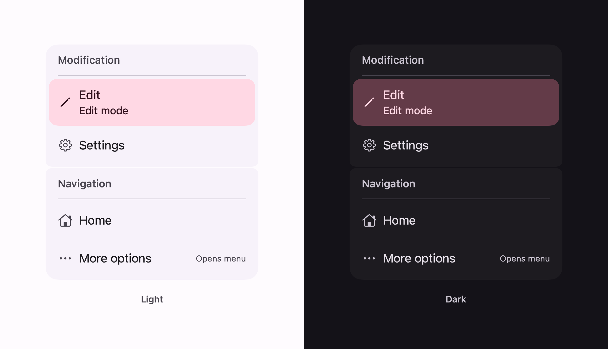
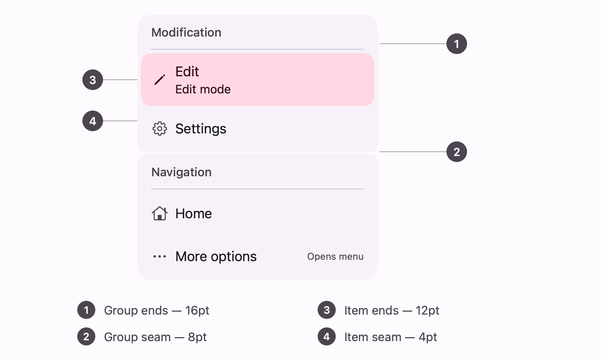

# Dropdown menu groups

Material 3's segmented dropdown menu: a stack of groups, each group a card, each item a chip inside
it, with the corners of both runs rounding at the ends and squaring in the middle.



```swift
ExpressiveMenu(groups: [
    .init("Modification", items: [
        .init("Edit", systemImage: "pencil", supportingText: "Edit mode", isOn: $editing),
        .init("Settings", systemImage: "gearshape") { openSettings() }
    ]),
    .init("Navigation", items: [
        .init("Home", systemImage: "house") { goHome() },
        .init("More options", systemImage: "ellipsis", trailingText: "Opens menu") { more() }
    ])
])
```

## The corner rule, twice



This is the component. A run — of groups, or of items inside a group — keeps its outer radius where
it faces the outside and takes a smaller one where it faces a sibling. Compose spells that out as
eight cached shapes picked by `MenuDefaults.groupShape(index:count:)` and `itemShape(index:count:)`;
here it is one function used twice, at two pairs of radii:

| Run | Ends | Seam |
| --- | --- | --- |
| Groups | 16 (`CornerLarge`) | 8 (`CornerSmall`) |
| Items | 12 (`CornerMedium`) | 4 (`CornerExtraSmall`) |

A **selected** item leaves the run: it is round on all four corners wherever it sits, at
`ItemSelectedShape`, and fills with `tertiaryContainer`.

Everything sits 2pt apart — `SegmentedGap`, the same 2 between items and between groups.

## Shadows

The groups are flat by default. Two cards two points apart each cast a shadow into the gap between
them, and the seam — the thing that makes a segmented menu read as segmented — muddies. The token
says otherwise, so the spec's own answer is one argument away:

```swift
ExpressiveMenu(groups: groups, elevation: .level2)   // SegmentedMenuTokens.ContainerElevation
```

Reach for it when the menu has to hold its own against busy content behind it.
`ExpressiveElevation` carries Material's six levels, each as the two shadows Android's key and
ambient lights actually cast — a tight one at 30% and a broad one at 15% — rather than a single
blurred one, which reads as fog.

## The menu paints nothing

There is no surface behind the groups. Compose's `DropdownMenuPopup` is a positioned column, and
each `DropdownMenuGroup` is its own `Surface` with its own container colour and shadow — which is
what makes it a *segmented* menu: the 2pt gaps are gaps, and whatever is behind the menu shows
through them.

## Items

Three kinds, picked by the initialiser you call, matching Compose's three:

| This | Compose | Behaviour |
| --- | --- | --- |
| `.init(_:systemImage:action:)` | `DropdownMenuItem` | Runs an action. |
| `.init(_:isOn:)` | `CheckableDropdownMenuItem` | Owns a checked state. |
| `.init(_:isSelected:action:)` | `SelectableDropdownMenuItem` | Is told it is the chosen one, and still acts. |

A checked item swaps its leading icon for `checkedSystemImage` — or for a checkmark when it has no
icon at all, which is how an item with nothing on its leading edge still shows its state.

Items can carry `supportingText` under the label and `trailingText` at the far edge.

## Presenting it

```swift
Button("Options") { showingMenu = true }
    .buttonStyle(.expressive(.tonal))
    .expressiveMenu(isPresented: $showingMenu, groups: groups)
```

That modifier is a popover, not a reimplementation of one, and it adds Material's opening: the menu
scales up from `ClosedScaleTarget` — 0.8 — and fades in. It needs iOS 16.4, which is where a popover
can be told to stay a popover on iPhone rather than adapting into a sheet. Below that, or for a
sheet or an inline panel, present `ExpressiveMenu` yourself — it is an ordinary view.

## Geometry

| Token | Value |
| --- | --- |
| `SegmentedGap` | 2 |
| `GroupPadding` | 4 |
| Item row | 48 min height |
| `ItemLeadingIconSize` / `ItemTrailingIconSize` | 20 |
| Item padding | 12 horizontal, 12 vertical |
| `DropdownMenuGroupLabelHorizontalPadding` | 12 leading, 4 trailing |
| `HorizontalDividerPadding` | 12 horizontal, 2 vertical |
| Menu width | 112 min, 280 max |

## Colour

| Part | Colour |
| --- | --- |
| Group container | `surfaceContainerLow` |
| Item label | `onSurface` |
| Item icons, supporting and trailing text | `onSurfaceVariant` |
| Selected item | `tertiaryContainer` / `onTertiaryContainer` |
| Group label | `onSurfaceVariant` |
| Divider | `outlineVariant` |

Selection uses the *third* accent rather than `primary`: a menu is usually opened by something that
is already the accent, and Material does not want the two competing.
