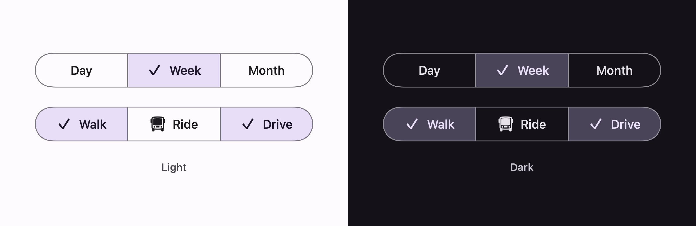

# Segmented buttons

Outlined segments in a single row, sharing their borders, with a checkmark that grows into the
selected one.



One choice out of a set — Compose's `SingleChoiceSegmentedButtonRow`:

```swift
ExpressiveSegmentedButtons(selection: $range, options: [
    .init(value: .day, label: "Day"),
    .init(value: .week, label: "Week"),
    .init(value: .month, label: "Month")
])
```

Any number of choices — `MultiChoiceSegmentedButtonRow`. Pass a `Set` and each segment toggles on
its own:

```swift
ExpressiveSegmentedButtons(selection: $modes, options: [
    .init(value: .walk, label: "Walk", systemImage: "figure.walk"),
    .init(value: .ride, label: "Ride", systemImage: "bus"),
    .init(value: .drive, label: "Drive", systemImage: "car")
])
```

Material asks for between two and five segments. Past five it wants chips instead.

## Which row is this, and which is the button group?

Both put choices in a row, and they are different components:

| | Segmented buttons | [Connected button group](ButtonGroup.md) |
| --- | --- | --- |
| Container | outlined, transparent | filled, `surfaceContainer` |
| Between segments | one shared border line | 2pt gap |
| Selection reads as | a checkmark, `secondaryContainer` fill | the segment becoming a pill, `primary` fill |
| Press | no size change | the segment widens, neighbours give way |

Segmented buttons came first. The connected group is what Expressive reaches for now, so prefer it
in new work and use these when you want the outlined, checkmarked look.

## The shared border

Segments overlap by exactly the border width, so two neighbours' borders land on one line rather
than stacking into a 2pt seam — Compose's `space` parameter, which defaults to the same
`BorderWidth`. The selected segment draws above its neighbours so its border is the one that
survives on the shared line.

## The checkmark

A segment with no icon of its own grows the checkmark out of the label's leading edge, and the label
slides over to make room: `scaleIn` from zero about `TransformOrigin(0f, 1f)`, on the spatial spring,
with the fade on the effects one.

A segment that *does* carry an icon crossfades between it and the checkmark instead, rather than
making room for a second glyph.

## Geometry

| Token | Value |
| --- | --- |
| `ContainerHeight` | 40 |
| `OutlineWidth` | 1 |
| `IconSize` | 18 |
| `ContentPadding` | 12 horizontal |
| Icon-to-label spacing | 8 |
| `Shape` | corner full at the row's ends, square between |

## Colour

| Part | Selected | Unselected |
| --- | --- | --- |
| Container | `secondaryContainer` | none |
| Label and icon | `onSecondaryContainer` | `onSurface` |
| Border | `outline` | `outline` |

Disabled drops the label to `onSurface` at 38% and the border to `onSurface` at 12%, per segment or
for the whole row.
