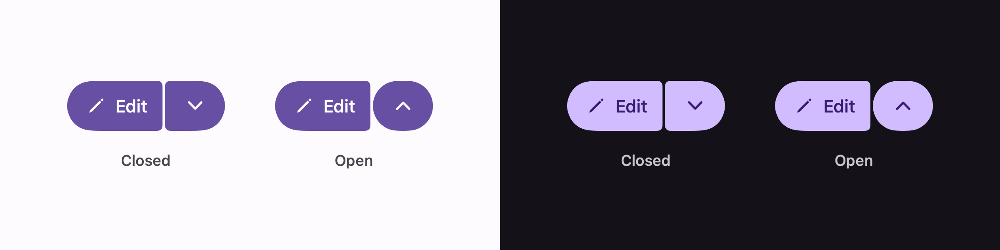

# Split button

One button that runs the primary action, and a narrower one beside it that opens whatever is
contextually related to it.



```swift
@State private var showingOptions = false

ExpressiveSplitButton("Edit", systemImage: "pencil", isExpanded: $showingOptions) {
    edit()
}
.popover(isPresented: $showingOptions) {
    optionsList
}
```

## Why a binding rather than a menu

The trailing half is a toggle, not a menu. That is how Compose has it: `SplitButtonLayout` takes two
buttons, and its sample attaches a menu to the trailing one itself. Binding the state here keeps the
presentation yours — a popover, a sheet, a panel of your own — while the component keeps the parts
Material specifies:

- the chevron turns over rather than swapping for a second glyph;
- the trailing button becomes a circle for as long as the thing it opened is open
  (`TrailingCheckedShape`).

If you want the system menu instead, drive the binding from your own `Menu` and leave the split
button's trailing action to toggle it.

## The corners

Outer corners are full at both ends. The two corners where the halves face each other are small —
and **open up** when that half is pressed, rather than tightening:

| Size | Height | Inner corner | Pressed | Trailing icon |
| --- | --- | --- | --- | --- |
| `.extraSmall` | 32 | 4 | 12 | 22 |
| `.small` (default) | 40 | 4 | 12 | 22 |
| `.medium` | 56 | 4 | 12 | 26 |
| `.large` | 96 | 8 | 20 | 38 |
| `.extraLarge` | 136 | 12 | 20 | 50 |

That is the opposite of what [the standalone button](Button.md) does under a press, and it is
deliberate: the two halves pull away from each other so you can see which one you are holding.

The halves sit `SplitButtonDefaults.Spacing` apart, which is 2 at every size.

## Colour

Both halves are filled buttons: `primary` container, `onPrimary` content. Disabled drops the
container to `onSurface` at 10% and the content to `onSurfaceVariant` at 38%, the same pair the
button uses.
