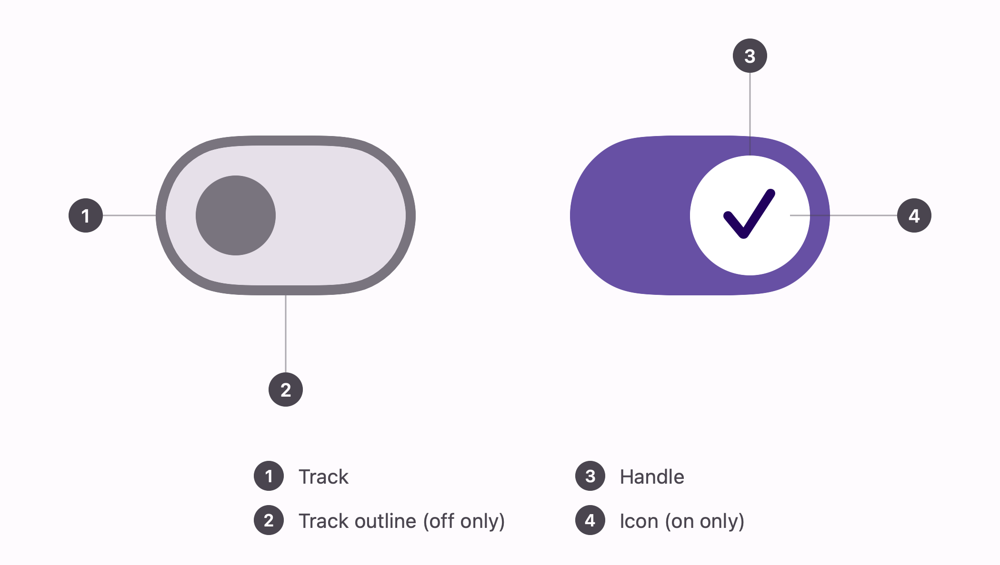
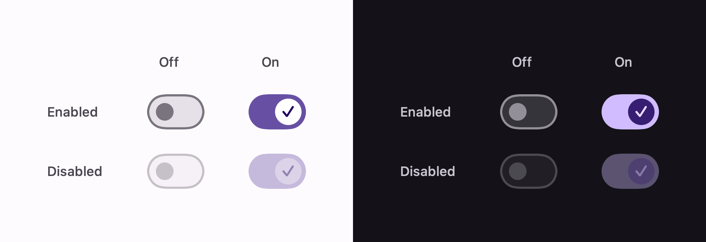

# Switch

Material 3's `Switch`, which is a different control from the one `Toggle` draws by default.


```swift
Toggle("Reminders", isOn: $remindersOn)
    .toggleStyle(.expressive)
```

## Anatomy



1. **Track** — the 52x32 capsule the handle travels in.
2. **Track outline** — 2pt, off only. On, the track is a solid fill and the outline disappears.
3. **Handle** — 16pt off, 24pt on, 28pt while pressed.
4. **Icon** — the check, on only.

## States



Pressing grows the handle to 28pt for as long as the finger is down, then it settles back. Disabled
drops the whole control to 38% opacity and stops responding.

## Geometry

Every value is a token from `material3`'s `SwitchTokens`:

| Token | Value |
| --- | --- |
| `TrackWidth` / `TrackHeight` | 52 x 32 |
| `UnselectedHandleWidth` | 16 |
| `SelectedHandleWidth` | 24 |
| `PressedHandleWidth` | 28 |
| `TrackOutlineWidth` | 2 |
| `SelectedIconSize` | 16 |

The thumb's travel follows Compose's derivation: the on-thumb sits 4pt from the trailing edge, the
smaller off-thumb 8pt from the leading one. Both are expressed as centres so the pressed thumb can
grow around them rather than shifting as it scales.

## Colour

| Part | Off | On |
| --- | --- | --- |
| Track | `surfaceContainerHighest` | `primary` |
| Track border | `outline`, 2pt | none — solid fill |
| Thumb | `outline` | `onPrimary` |
| Check glyph | — | `onPrimaryContainer` |

The check is the accent again, not a hole punched in the thumb. Disabled's 38% opacity is Material's
disabled alpha.

## Why a `ToggleStyle`

Call sites stay ordinary `Toggle`s, which keeps their accessibility for free. The style draws the
label itself — a `ToggleStyle` owns the whole control, so one that renders only the switch would
silently discard whatever the call site put in the `Toggle`'s body.

If your row lays out its own text, pass an empty label; the trailing spacer collapses to nothing.

