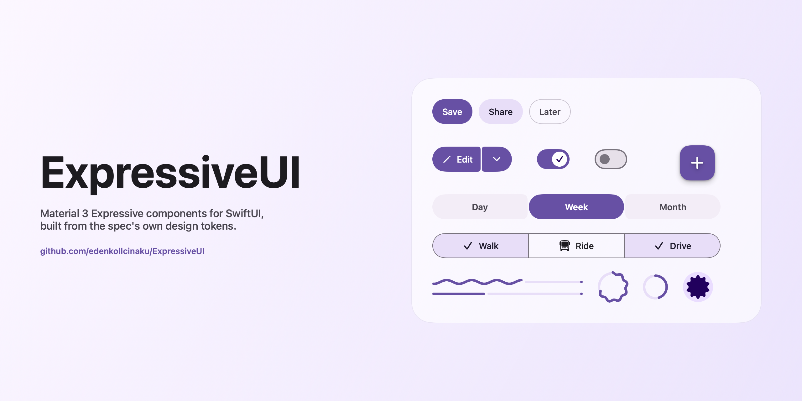
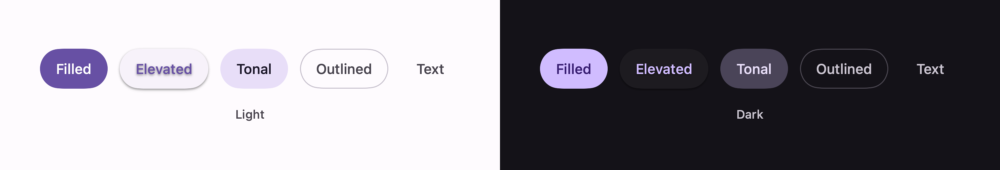
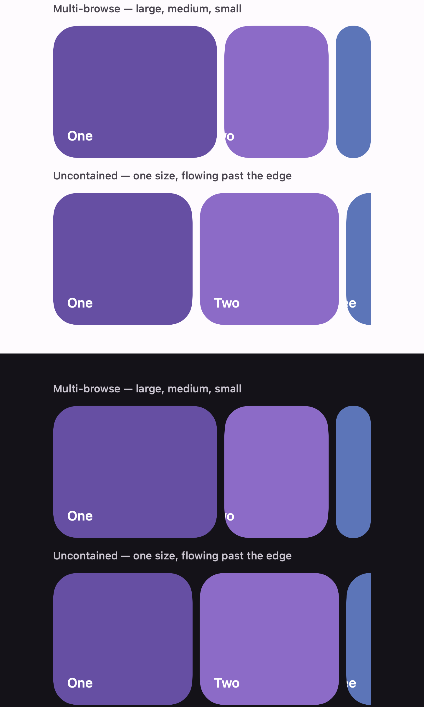
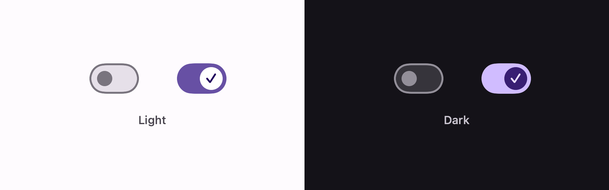
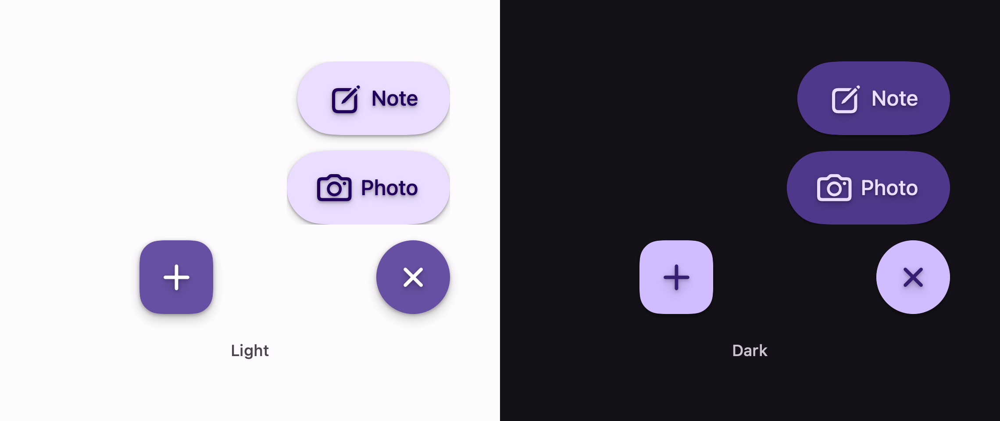
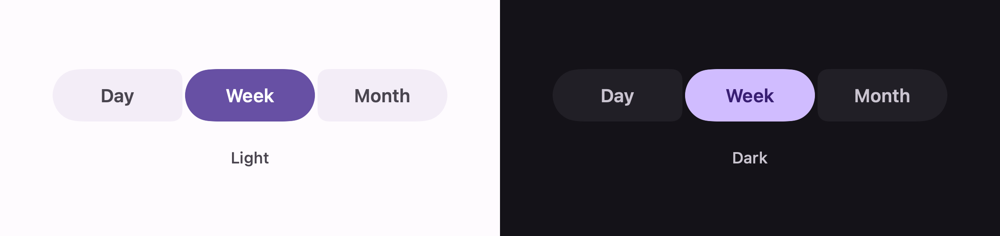

# ExpressiveUI

<a href="https://www.buymeacoffee.com/pixel.al"></a>



Material 3 Expressive components for SwiftUI, built from the spec's own design tokens.

SwiftUI's stock controls are UIKit's controls. Material 3 names different geometry, different
colour roles, and different motion for the same idea — a Material switch is not a tinted
`Toggle`. ExpressiveUI implements those controls properly, one at a time, with each measurement
traced back to the token it comes from rather than eyeballed from a screenshot.

Extracted from a shipping app, so every component here is one that survived real use.

> Not affiliated with or endorsed by Google. "Material Design" is Google's trademark; this is an
> independent SwiftUI implementation of the publicly documented specification.

## Install

```swift
.package(url: "https://github.com/edenkollcinaku/ExpressiveUI.git", from: "0.1.0")
```

Requires iOS 16 / macOS 13.

## Use

```swift
import ExpressiveUI

Toggle("Reminders", isOn: $remindersOn)
    .toggleStyle(.expressive)
```

That renders with Material 3's baseline scheme. To use your own palette, map it onto
`ExpressiveColors` once near the root:

```swift
struct RootView: View {
    @Environment(\.colorScheme) private var scheme

    var body: some View {
        ContentView()
            .expressiveColors(
                ExpressiveColors(
                    primary: brand(scheme),
                    onPrimary: onBrand(scheme),
                    onPrimaryContainer: brand(scheme),
                    surfaceContainerHighest: elevated(scheme),
                    outline: outline(scheme)
                )
            )
    }
}
```

Components read the set from the environment, so styling is one call and never per-component.

Motion comes from the same place. `ExpressiveMotion` carries Material's six springs — three for
things that move, three for things that only change colour — so components animate at the rates the
spec names rather than at ones tuned by hand.

## Components

| Component | Style | Docs |
| --- | --- | --- |
| Button | `.buttonStyle(.expressive)` | [Docs/Button.md](Docs/Button.md) |
| Carousel | `ExpressiveCarousel` | [Docs/Carousel.md](Docs/Carousel.md) |
| Switch | `.toggleStyle(.expressive)` | [Docs/Switch.md](Docs/Switch.md) |
| FAB menu | `ExpressiveFABMenu` | [Docs/FABMenu.md](Docs/FABMenu.md) |
| Button group | `ExpressiveButtonGroup`, `ExpressiveConnectedButtonGroup` | [Docs/ButtonGroup.md](Docs/ButtonGroup.md) |
| Segmented buttons | `ExpressiveSegmentedButtons` | [Docs/SegmentedButtons.md](Docs/SegmentedButtons.md) |
| Split button | `ExpressiveSplitButton` | [Docs/SplitButton.md](Docs/SplitButton.md) |
| Menu | `ExpressiveMenu` | [Docs/Menu.md](Docs/Menu.md) |
| Loading indicator | `ExpressiveLoadingIndicator` | [Docs/LoadingIndicator.md](Docs/LoadingIndicator.md) |
| Progress indicator, linear | `ExpressiveLinearProgressIndicator`, `ExpressiveLinearWavyProgressIndicator` | [Docs/LinearProgressIndicator.md](Docs/LinearProgressIndicator.md) |
| Progress indicator, circular | `ExpressiveCircularProgressIndicator`, `ExpressiveCircularWavyProgressIndicator` | [Docs/CircularProgressIndicator.md](Docs/CircularProgressIndicator.md) |











More land progressively — dialog, menu, and container transform are queued, roughly in that order. `ExpressiveColors` gains roles as they arrive; additions are minor versions and
existing initialiser calls keep compiling.

## Status

`0.x`. The colour surface is still settling. Component APIs are stable in shape — they are
`ToggleStyle`s, `ButtonStyle`s, and views, so your call sites stay ordinary SwiftUI.

## Licence

MIT. See [LICENSE](LICENSE).
